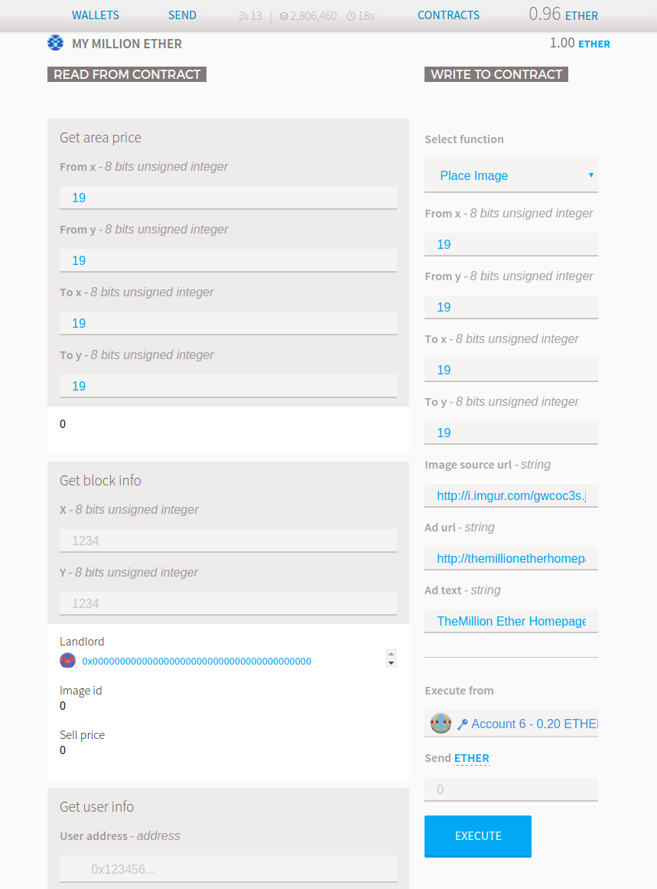

.. _ads:

#########
PLACE ADS
#########

**Video:**

`The Million Ether Smart Contract - place ads (3:12) <https://youtu.be/mTgXJVlBVdI>`_ todo?

As the most parts of this project image storage is decentralized. It is currently too expensive to place images within the blockchain we use imgur.com for image hosting. It is free and easy to use. 

**1. Upload your image to imgur.com.**

- Go to imgur.com and drag and drop your image to the website or click New post.

.. note::

    Please upload images with width and height corresponding to the pixels you bought otherwise cropping will occur (e.g. if you bought blocks from [1:1] to [1:2], upload two 10x10 px images or one 10x20 px image).

- Hover over the image, right-click and select **Copy image location**. You need a direct link - the one which ends with .jpg or .png. 

.. image:: img/imgur.jpg

- Go to Contracts -> My Million Ether -> WRITE TO CONTRACT -> Select function -> Place Image.

From x, From y, To x, To y
    type coordinates to place image to (place as many 10x10 px images as you can fit within your area). If you would like to place 10x10 pixels image type the same from and to coordinates (e.g. From x  1, From y  2, To x  1, To y  2).
Image source url
    paste your imgur image link from the previous step (Links from other hosting services will be stored in the blockchain, but will not appear at TheMillionEtherHomepage.com)
Ad url
    put your website address. Make sure to put a valid url. Internationalized domain names (chinese, russian, greek, etc.) are not supported. Make sure you are not advertising anything obscene - :ref:`Read our advertising policies <policies>`. 

Ad text
    put your 140 character ad text which will appear when somebody hovers over your ad. Use `Twitter <https://twitter.com/>`_ or `charactercountonline.com <http://www.charactercountonline.com/>`_ to measure the length (Longer ad text will be stored in the blockchain, but appear truncated at TheMillionEtherHomepage.com)
Send Ether
    leave 0

*In this example an ad occupying 4 blocks (20x20 pixels) is submitted.* 

- Click Execute and confirm transaction.

.. note::

    If you receive “It seems this transaction will fail, it may consume all the gas you send” do not send the transaction and check the coordinates. Go to Contracts -> My Million Ether -> Read from contract ->  Get block info type your coordinates and make sure your address appears.

.. note::

    To see your info written to the blockchain wait a couple of seconds until your transaction is mined (approx. 15 seconds for the Ethereum blockchain as of 11.17.2016). Go to Contracts -> My Million Ether -> Read from contract ->  Get block info type your coordinates and copy Image id. Go to  Contracts -> My Million Ether -> Read from contract ->  Get image info and paste your image id. 

In a couple of minutes your ad will appear at TheMillionEtherHomepage.com.