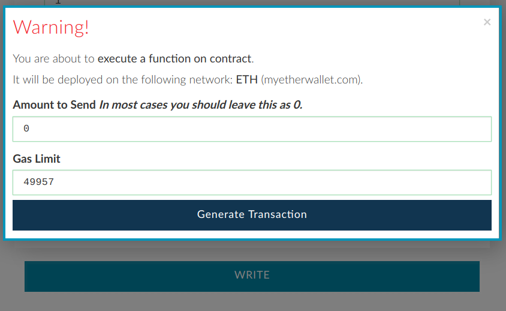

.. _ads:

#########
PLACE ADS
#########

**Video:**

`Video instructions - place ads (3:12) <https://youtu.be/mTgXJVlBVdI>`_

Currently all images need to be uploaded to imgur.com. It is free and easy to use.

**1. Upload your image to imgur.com.**

- Go to imgur.com and drag and drop your image to the website or click New post.

.. note::

    Please upload images with width and height corresponding to the pixels you bought otherwise cropping will occur (e.g. if you bought blocks from [1:1] to [1:2], upload two 10x10 px images or one 10x20 px image).

- Hover over the image, right-click and select **Copy image location**. You need a direct link - the one which ends with .jpg or .png. 

.. image:: img/imgur.jpg

**2. Make sure you can place ads**

You can only place ads if own or rent area. If you own an area, but rented it out to somebody, you'll have to wait until rent expires to be able to place images.

- In :ref:`contract interface <interface>` select **canAdvertise** function (in some wallets may appear under Read section or similar).
- Specify :ref:`coordinates <coordinates>` you would like to check.
- Click **Read** (you are not paying any gas here).

You should see **True** response, meaning that you can place ads within specified area.

**3. Place ads**

- In :ref:`contract interface <interface>` select **placeAds** function (in some wallets may appear under Write section or similar). 

- Specify function parameters:

    *fromX, fromY, toX, toY:*
        :ref:`coordinates <coordinates>` to place image to. If you would like to place only one 10x10 pixels image, type the same from and to coordinates (e.g. From x  1, From y  2, To x  1, To y  2).
    *imageSource:*
        paste your imgur image link from the previous step (other links will be accepted, but will not appear at TheMillionEtherHomepage.com)
    *link:*
        your website address. Internationalized domain names (chinese, russian, greek, etc.) are not supported. :ref:`See advertising policies <policies>`.
    *text:*
        put your 140 character ad text which will appear when somebody hovers over your ad. Use `Twitter <https://twitter.com/>`_ or `charactercountonline.com <http://www.charactercountonline.com/>`_ to measure length (longer ad text appear truncated)

*In this example an ad occupying 2 blocks (10x20 pixels) is submitted.*

- Select your wallet and click **Write**.

    *Amount to Send*
        0 (do not send any ether)
    *Gas Limit*
        Should be calculated automatically.

- Click **Generate transaction**, sign it, send it and wait until it is mined.

.. note::

    If Gas Limit box remains highlighted in red do not send the transaction and check the coordinates.

**Next steps:**

In a couple of minutes your ad will appear at TheMillionEtherHomepage.com. If something goes wrong, error warning and further instructions will be shown instead of your text.

You are free to replace your image anytime you like.

- :ref:`Rent out pixels <rent_out>` 
- :ref:`Sell pixels <sell>`
- :ref:`Advertising policies <policies>`.
