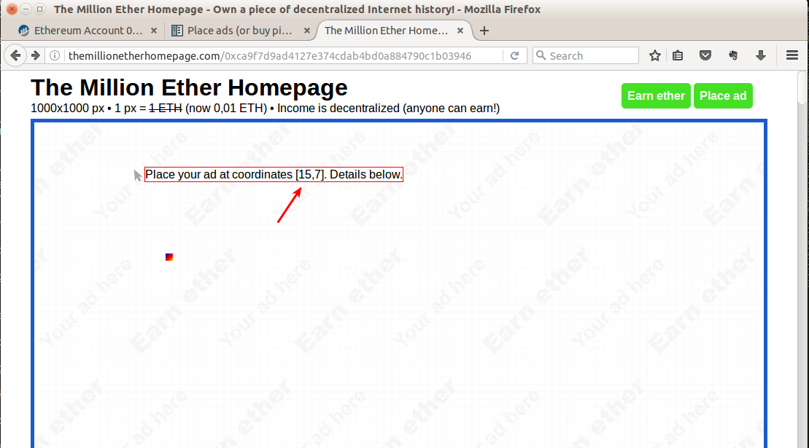
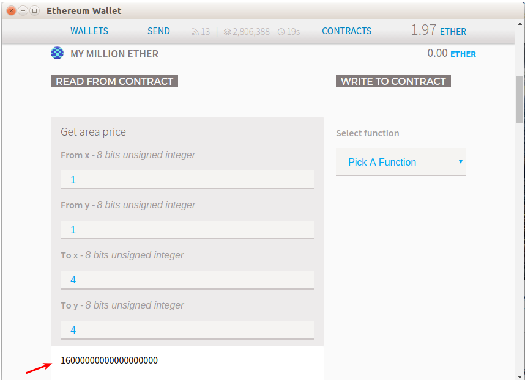
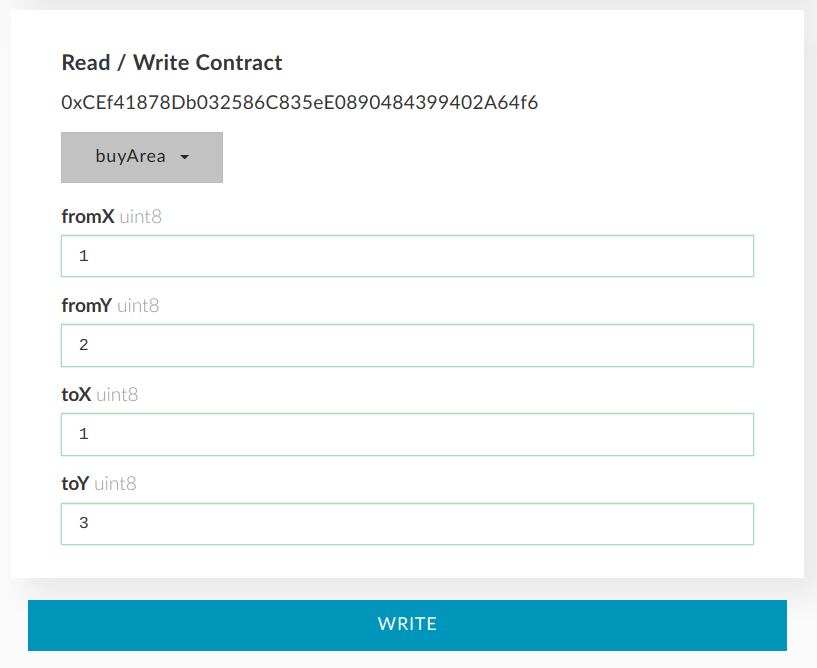

.. _buy:

##########
BUY PIXELS
##########

o
o
o
o
o
o

**UNDER DEVELOPEMENT**

o
o
o
o
o
o

.. _coordinates:

**1. Decide which coordinates you would like to buy.**

Pixels are sold in 10x10 pixel blocks. There are 100x100 blocks available (10 000 in total). Blocks are referenced by [x:y] coordinates starting from the left upper corner - [1:1]. The right bottom corner block is [100:100].

- Go to TheMillionEtherHomepage.com in your web browser and hover cursor over a block.

- Look at the block coordinates shown in square brackets.

.. _area_price:

**2. Check the price and availability of selected area.**

- In :ref:`contract interface <interface>` select **areaPrice** function (in some wallets may appear under Read section or similar).

- type in block coordinates you would like to buy:
    *From x, From y, To x, To y*
    	Type “from block” and “to block” coordinates if you are buying several blocks. If you would like to buy just one block type the same from and to coordinates (e.g. From x 1, From y 2, To x 1, To y  2). 

- Click **Read** (you are not paying any gas here) and copy the price.
    You'll ether get a price in wei (`ether unit converter <http://ether.fund/tool/converter>`_) or zero price meaning that some or all of the blocks are already bought and owner is not willing to sell.

*In this example 4 blocks (20x20 pixels) in the left upper corner are bought. The price here is 4 USD, shown in wei according to current ETHUSD price.*

**3. Buy area**

- In :ref:`contract interface <interface>` select **buyArea** function (in some wallets may appear under Write section or similar).

- Type in the same coordinates as in previous step:

    *From x, From y, To x, To y*
        Same as previous step 

- Select your wallet and click **Write**.

    *Amount to Send*
        Paste the price in wei obtained at the previous step
    *Gas Limit*
        Should be calculated automatically.

- Click **Generate transaction**, sign it, send it and wait until it is mined.

.. note::

	todo If you receive “It seems this transaction will fail, it may consume all the gas you send” or something similar do not send the transaction. Check the availability and price again - maybe someone has already bought the blocks you are trying to buy. Another reason may be buying too many blocks (more than 38) at once causing insufficient gas.

.. _area_ownership:

**4. (Optional) Make sure that the area you bought belongs to you**

- In :ref:`contract interface <interface>` select **getBlockOwner** function (in some wallets may appear under Read section or similar).
- Type in block coordinates:
    *x, y:*
        Coordinates of a block (you are not checking an area here, but rather blocks one by one).

- Click **Read**. 

    You'll see an address. Make sure it is yours. If no address appears (or it is 0x), the block doesn't belong to anybody. 
 
**Next steps:**

Now the area of pixels belongs to you. Next you can:

- :ref:`Place your ad <ads>` 
- :ref:`Rent out pixels <rent_out>` 
- :ref:`Sell pixels <sell>`
