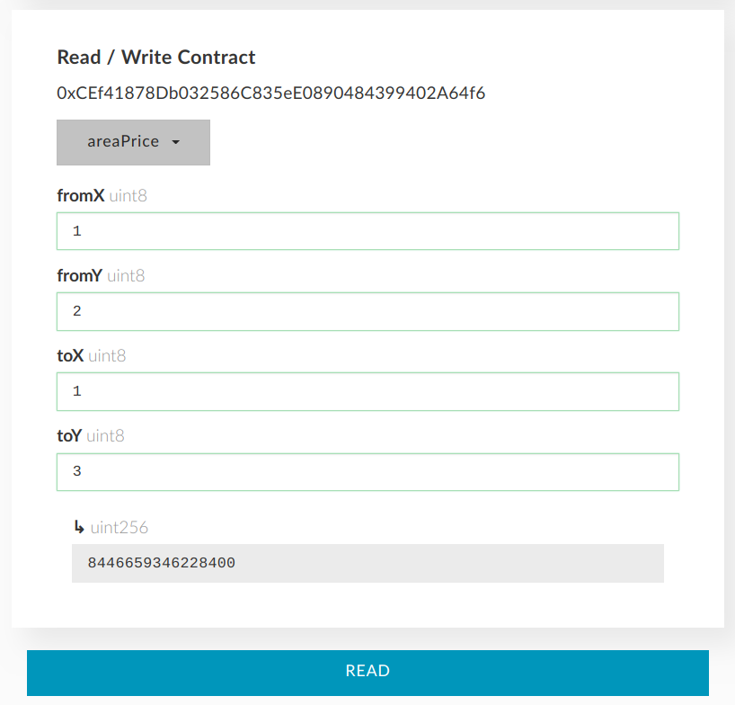

.. _buy:

##########
BUY PIXELS
##########

**Video:**

..  todo

`The Million Ether Smart Contract - buy pixels (4:45) <https://youtu.be/TzghOMKLVOg>`_

**0. Load contract interface.**
    
    :ref:`How to interact with the smart contract <interface>`

.. _coordinates:

**1. Decide with the coordinates you would like to buy.**

- Go to TheMillionEtherHomepage.com/[somereferral] in your web browser and hover your cursor over a block.

- Find block coordinates shown in square brackets.

.. image:: img/browser_coordinates.png

.. note::

	Pixels are sold in 10x10 pixel blocks. As there are 1000x1000 pixels 100x100 blocks are available for purchase. Blocks are referenced by [x:y] coordinates starting from the left upper corner. The left upper corner block is [1:1], the right bottom corner block is [100:100].

**2. Check the price and availability of the selected pixels.**

- In EthereumWallet Go to Contracts -> My Million Ether -> Read from contract ->  Get area price
- type in block coordinates you would like to buy.

*From x, From y, To x, To y*
	Type “from block” and “to block” coordinates if you are buying several blocks. If you would like to buy just one block (10x10 pixels) type the same from and to coordinates (e.g. From x 1, From y 2, To x 1, To y  2). 

*In this example 4 blocks (20x20 pixels) in the left upper corner are bought. The price here is 4 ETH (Ethereum Wallet shows it in wei by default).*

.. note::

	The price is shown in wei (ether smallest denomination, use `unit converter <http://ether.fund/tool/converter>`_). If you see 0 price it means, that some or all of the blocks are already bought and owner didn't set the sell price (decided to keep it). 

**3. Send transaction**

- In EhtereumWallet go to Contracts -> My Million Ether -> WRITE TO CONTRACT -> Select function -> Buy Blocks.

- Type in the same coordinates and price as in the previous step, click Execute and confirm the transaction. Here unlike previous step we buy just 1 block with coordinates [19,19].

.. note::

	If you receive “It seems this transaction will fail, it may consume all the gas you send” do not send the transaction. Check the availability and price again (previous step). Maybe someone has already bought the blocks you are trying to buy.

.. note::

	To see your info written to the blockchain wait a couple of seconds until your transaction is mined (approx. 15 seconds for the Ethereum blockchain as of 12.14.2016). Go to Contracts -> My Million Ether -> Read from contract ->  Get block info type your coordinates and make sure your address appears. 

**Next steps:**

- :ref:`Place your ad <ads>` 
- :ref:`Rent out pixels <rent_out>` 
- :ref:`Sell pixels <sell>`
