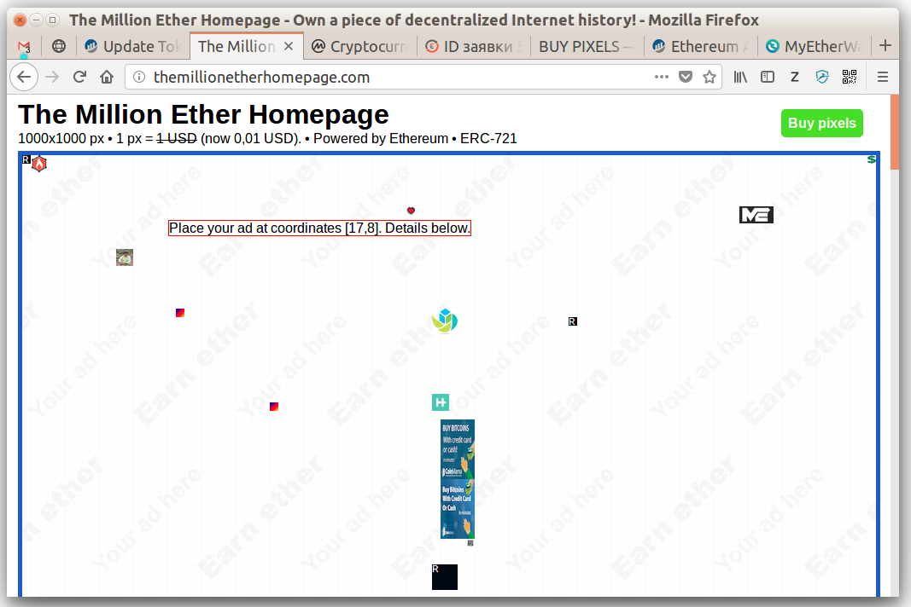

.. _buy:

##########
BUY PIXELS
##########

o
o
o
o
o
o

**UNDER DEVELOPEMENT**

o
o
o
o
o
o

**Video:**

..  todo

`The Million Ether Smart Contract - buy pixels (4:45) <https://todo>`_

.. _coordinates:

**1. Decide with the coordinates you would like to buy.**

Pixels are sold in 10x10 pixel blocks. There are 100x100 blocks available. Blocks are referenced by [x:y] coordinates starting from the left upper corner - [1:1]. The right bottom corner block is [100:100].

- Go to TheMillionEtherHomepage.com in your web browser and hover cursor over a block.

- Find block coordinates shown in square brackets.

**2. Check the price and availability of selected area.**

- In :ref:`contract interface <interface>` select **areaPrice** function (in some wallets may appear under Read section or similar).

- type in block coordinates you would like to buy.

*From x, From y, To x, To y*
	Type “from block” and “to block” coordinates if you are buying several blocks. If you would like to buy just one block type the same from and to coordinates (e.g. From x 1, From y 2, To x 1, To y  2). 

.. image:: img/block_price.png

*In this example 4 blocks (20x20 pixels) in the left upper corner are bought. The price here is 4 USD, shown in wei according to current ETHUSD price.*

.. note::

	The price is shown in wei (ether smallest denomination, use `ether unit converter <http://ether.fund/tool/converter>`_). 

If the price is 0 it means, that some or all of the blocks are already bought and owner didn't set the sell price.

- Copy the price.

.. note::

    You'd probably better check rent status of the area as well. If there is an active rent you will be able to buy an area, but you'll have to wait until the rent is finished to place images. todo

**3. Buy area**

- In :ref:`contract interface <interface>` select **buyArea** function (in some wallets may appear under Write section or similar).

- Type in the same coordinates and price as in the previous steps.

- Send transaction and wait until it is mined.

.. image:: img/buy_blocks.png

.. note::

	If you receive “It seems this transaction will fail, it may consume all the gas you send” or something similar do not send the transaction. Check the availability and price again. Maybe someone has already bought the blocks you are trying to buy.

.. _area_ownership:

**4. Make sure that the area you bought belongs to you**

In a couple of minutes after buy-transaction is mined you'll see that the area you bought is marked as reserved at TheMillionEtherHomepage.com. If you want a faster confirmation follow the steps below. 

- In :ref:`contract interface <interface>` select **getBlockOwner** function (in some wallets may appear under Read section or similar).
- Type [x,y] coordinates and make sure your address appears. You'll have to check coordinates one by one here.

**Next steps:**

- :ref:`Place your ad <ads>` 
- :ref:`Rent out pixels <rent_out>` 
- :ref:`Sell pixels <sell>`
