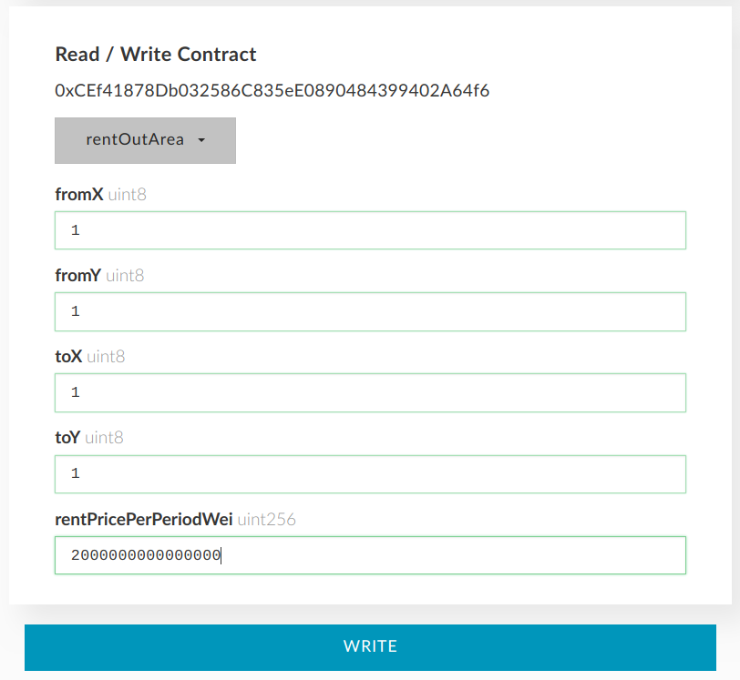
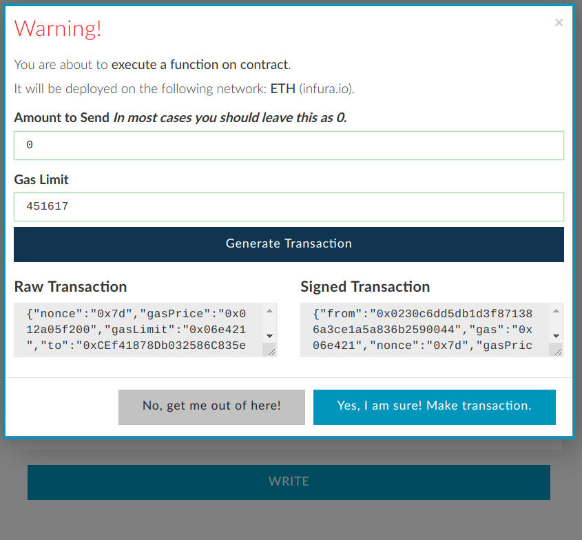

.. _rent_out:

###############
RENT OUT PIXELS
###############

Rent out area you own. Anybody will be able to rent it (90 days max) for the price you specified. You get all the money with no fees. 

Only renter (not owner) is able to place ads within rented area until rent expires. Owner is still able to sell rented area.

**1. Rent out area**

- In :ref:`contract interface <interface>` select **rentOutArea** function (in some wallets may appear under Write section or similar).

- Specify function parameters.

    *fromX, fromY, toX, toY:*
        :ref:`coordinates <coordinates>` you would like to rent out.
    *rentPricePerPeriodWei:*
        rent price per block per day in wei (max is 90 days).

- Select your wallet and click **Write**.

    *Amount to Send*
        0 (do not send any ether)
    *Gas Limit*
        Should be calculated automatically.

- Click **Generate transaction**, then **Yes, I am sure! Make transaction** and wait until it is mined.

**2. (Optional) Make sure that the area is available for rent**.

Same as :ref:`Checking rent status and getting rent price <rent_price>` in Rent section.

- In :ref:`contract interface <interface>` select **areaRentPrice** function.

- Specify function parameters:

    *fromX, fromY, toX, toY:*
        :ref:`coordinates <coordinates>` you would like to check.
    *numberOfPeriods:*
        1 (You need one day here as you've specified rent price per day)

- Click **Read** and check that the total price you see is the one you want (you are not paying any gas here).

.. note::

    Remember that when renting area out you specify price per day per 10x10 pixels block. Here you get the total price for the whole area. Divide it by the number of blocks in area and get your rent price per day per block. The price is wei (`Ether unit converter <https://etherconverter.online/>`_).

Now the area is available for rent. When somebody rents it you'll get eth. After that you'll need to withdraw it from your balance. Until then you are still able to place ads and cancel rent or set another rent price. Even after somebody rents your area you can sell it. 

.. _cancel_rent:

**3. Cancel further rent deals**

If somebody already rented your area you cannot cancel it. But you can cancel further rent deals immediately by setting rent price to 0. When current rent expires your area will not be available for rent.

- In :ref:`contract interface <interface>` select **rentOutArea** function (in some wallets may appear under Write section or similar).

- Specify function parameters.

    fromX, fromY, toX, toY:
        :ref:`coordinates <coordinates>` you no longer want to rent out.
    rentPricePerPeriodWei:
        **set price to 0**.

- Select your wallet and click **Write**.

    *Amount to Send*
        0 (do not send any ether)
    *Gas Limit*
        Should be calculated automatically.

- Click **Generate transaction**, sign it, send it and wait until it is mined.

**Next steps:**

- :ref:`Withdraw funds <withdraw>`
- :ref:`Sell pixels <sell>`